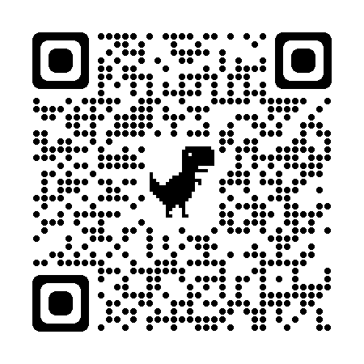
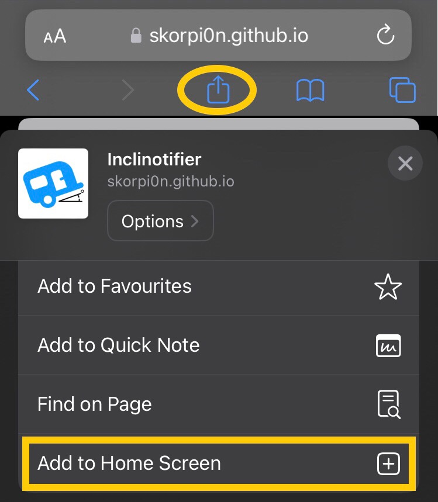
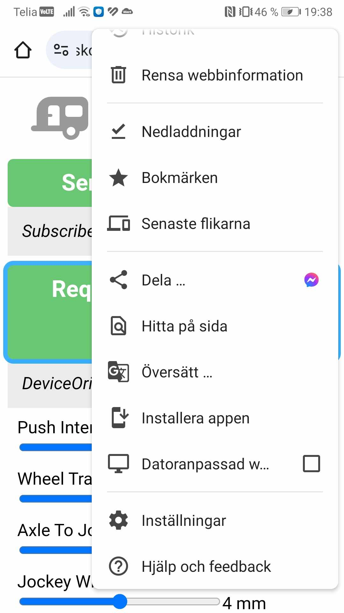

# Inclinotifier

## What is it and what does it do?

Inclinotifier is a Web App that uses a smart phone's motion sensor to determine the current level and then notifies the user by a connected smart watch (or similar device that can receive notifications) by sending push notifications to itself

## Requirments
iPhone/iPad with at least iOS 16.4

Android-device

A Smart Watch or similar device that can receive push notifications from your mobile device.
	For example, I can either use my Garmin Forerunner 935 (watch) or my Garmin Edge 830 (cycling computer) to receive push notifications.

## How do I use it?

After you have installed and setup Inclinotifier on your device, tap the Caravan button on the left upper corner.
You will be instructed to place your device on a flat surface (preferrable close to the stove).
Be sure to place the device's top so that it's pointing in the forward direction.
It will then count down until it starts measuring the degrees to adjust.
You will receive a notification on your device that also should be sent to your smart watch with instructions.

Push notifications are sent each 5s (default value), for the direction (X / Z) with largest deviation.

See example usage below

https://github.com/skorpi0n/inclinotifier/assets/47179304/72edbfb0-8745-43a9-b1c7-988ab3b1f38d

## Installation
Visit https://skorpi0n.github.io/inclinotifier/ from your mobile device or simply scan this QR-code from you mobile device 
 
Follow instructions on your mobile device.

iOS: Add the website to your home screen (or push notifications will not work) 
 
Android: Browse to web-page and you are all set up 
NOTE! Some Android devices need the WebApp to be installed (or push notifications will not work) 
 

## Setup
For best experience you should change some settings to fit your needs.
Most important are the:
- Wheel-track distance: Set it to the distance between your wheels.
- Axle to jockey wheel: Set it to the distance between your axle and your jockey wheel.
- Jockey wheel thread pitch: Set it to the thread pitch of the jockey wheel

If you have a mobile device which cant be layed flat on a surface because of camera sticking out, you will also need to calibrate your device to compensate for this offset.

You are also able to change the following settings if you would like.
- Push Interval: The time in seconds between each push notification.

## Features
- Visual representation of side and front with angle and distance left
- Push Notification
- Ability to set Wheel Track Distance (wheel to wheel)
- Ability to set Wheel To JockyWheel Distance
- Ability to set Jockey Wheel Thread Pitch
- Ability to calibrate the motion sensors.
	(Especially good for phones with cameras which sticks out on the back which prevents the phone to lay perfectly flat)
- Ability to set push notification interval in seconds
- Ability to change language (English / Swedish)
- Ability to change units of measure (metric / imperial)

## FAQ
- **How do I know the Jockey Wheel Thread Pitch?**
  - Probably you can go with the default value of 4mm
  - To have it more exact:
      1. Retract the jockeywheel fully
      2. Put a mark somewhere so that you can measure the extended distance later
      3. Extend the wheel as many turns you can achieve without getting the jockey wheel falling apart. I did 40 turns.
      4. Measure the distance that it has been extended
      5. Divide by the number turns you did (40). This value will be the Thread Pitch

## History
This idea came to my mind shortly after I bought my first caravan and thought that it should be possible to utilize my smartphone (iPhone 8) as an inclinometer (spirit level) and send push notifications to itself which would then show up on my smart watch (Garmin Forerunner 935), with guidance on how to level my caravan.

At first investigation in 2022, push notifications was only possible from a native app (on an iOS device) and since I wasnt't very fond of spending $99 per year for a Apple Dev-account, the idea was postponed.

In mid March 2024 I finally found out that Push Notifications was introduced with iOS 16.4 (released 2023-03-27), aslong as you provide a secure connection (https://) and add it as a bookmark on "Home Screen", which will let it run almost like a native app.

The work then began to make this Web App.

If you like my Web App, please support my Work!
 

## Milestones already reached
1. Proof of concept with working caravan X/Z tilt visualization (build 3e385b8)
2. First public release (v1.0.0-rc1)

## Not working (not possible at the moment)
1. Audio notifications / SpeechSynthesis 
	For SpeechSynthesis to work, it needs user interaction in the form of a click or similar.

## Milestones to reach
1. Toggle Push / ~Audio notification~ (when smartwatch is not available)
	Text to speech
	https://developer.mozilla.org/en-US/docs/Web/API/Web_Speech_API/Using_the_Web_Speech_API
	https://codepen.io/matt-west/pen/DpmMgE
	 **NOTE: Not possible since it can only be triggered by user interaction.**

2. Add ability to change icon to RV, car, spirit level. Anything more?

## TODO list

:white_large_square: Make caravan image-boxes better, to be able to rotate and mirror them more effectively

:white_check_mark: Ability to show Jockey-wheel revolutions to turn.

:white_check_mark: Ability to change language

:white_check_mark: Update icon and add splash image?

:white_check_mark: Add ability to toggle between Metric / Imperial?

:white_check_mark: Make the Z/X angle with largest movement since last push to be the next push.

:white_check_mark: Replace home icon with tilted caravan icon

:white_check_mark: Calibration ability in the settings view

:white_large_square: Add to settings
	if degree <= x, send push with level completed message

:white_large_square: When should push be sent?
	Send push only on +/-1 change and max every 5s?
	On every change 1 degree, check if currentTS is greater than timerStartTS+5s, then do a push?

:white_large_square: Add ability to change axleToJockeyWheel distance by clicking on the caravan image
	~Push on wheel base should increase length to jockey wheel by 250mm?
	touchstart and touchend should increase length by 100 each x?
		Read more at https://developer.mozilla.org/en-US/docs/Web/API/Touch_events/Using_Touch_Events
		How to destinguis a horizontal touchmove? Can I use vertical touchmove to something else?
			If vertical move is within 20% of start, then it should be considered as horizontal and vice versa
			How will horizontal touchmove react in portrait/landscape mode?~

:white_check_mark: Show distance in image

:white_check_mark: Save variables to local storage?
	
:white_large_square: Add icon with transparent bg in favicon.png

:white_large_square: Investigate what can be put in manifest.json

## <ins>Version History</ins>

**April 23th 2024 (v1.0.0-rc1)**

**March 15th 2024 (Initial Commit)**
First release with proof of concept.
